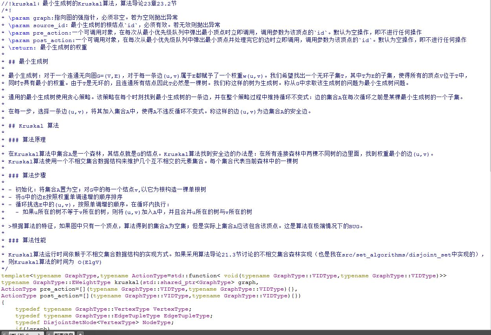

# The C++ Realization of the Algorithm in "Introduction to Algorithms"

<!--
   author’s email: huaxz1986@163.com and 2441164168lhd@gmail.com
**  This document can be used for personal learning purposes, not for commercial purposes  **
-->

All algorithms in this project are from the third edition of "Introduction to Algorithms".

Another: I collected personal notes and organized them into a book, named "AI Algorithm Engineer Handbook", see:www.huaxiaozhuan.com

## Reasons:

> Scanned note address：http://pan.baidu.com/s/1mis5sOK AND http://pan.baidu.com/s/1mhKFxQ4

> Download address of scanned version of all notes：http://pan.baidu.com/s/1boSzlx1

In order to better promote learning, I now organize these codes (mainly adding `Doxygen` comments, and using `googletest` to add test codes)

## Structrue:

* File structrue:

```
src\
	dynamic_programming_algorithms\: 动态规划算法
			       lcs： 最长公共子序列算法
	google_test\           : gooletest框架的两个文件：gtest.h以及gtest_all.c
	sort_algorithms\       :所有排序算法
			bucket_sort: 桶排序
			count_sort:计数排序
			heap_sort：堆排序
			insert_sort：插入排序
			merge_sort:归并排序
			quick_sort：快速排序
			radix_sort：基数排序
	select_algorithms\     :顺序统计量选择算法
			randomized_select：随机选择的顺序统计量算法
			good_select：最坏情况为O(n)的顺序统计量算法
	tree_algorithms\       :树算法
			binarytree:二叉树
			binarytreenode：二叉树结点
			searchtree:二叉搜索树	
	queue_algorithms\	：队列算法
			min_queue: 最小优先级队列
	set_algorithms\		：集合算法
			disjoint_set： 不相交集合森林
	graph_algorithms\    ：图算法
			basic_graph\ :基本图算法
					graph_representation\ ：图的表示
								graph_vertex：图的顶点
								graph_edge:图的边
								adjlist_graph：图的邻接表的表示法
								matrix_graph：图的矩阵表示法
								graph: 图
					graph_bfs:图的广度优先搜索算法
					graph_dfs：图的深度优先搜索算法
					topology_sort：有向无环图的拓扑排序算法
					strong_connected_component:有向图的强连通分量算法
					connected_component:无向图的连通分量算法
			minimum_spanning_tree\ ：无向图最小生成树算法
					kruskal ： 最小生成树的 kruskal 算法
					prim : 最小生成树的 prim 算法
			single_source_shortest_path\: 有向图单源最短路径算法
					bellman_ford :单源最短路径的 bellman_ford算法
					dag_shortest_path:单源最短路径的dag_shortest_path算法
					dijkstra：单源最短路径的dijkstra算法
			all_node_pair_shortest_path\ :有向图所有结点对之间的最短路径算法
					matrix_shortest_path：结点对之间最短路径的矩阵算法和复平方算法
					floyd_warshall：所有结点对之间最短路径的floyd_warshall算法
					johnson:所有结点对之间最短路径的johnson算法
			max_flow\ : 流网络的最大流算法
					ford_fulkerson： 流网络的ford_fulkerson最大流算法
					generic_push_relabel：流网络的“推送-重贴标签”最大流算法
					relabel_to_front：流网络的“前置-重贴标签”最大流算法
			string_matching_algorithms\ :字符串匹配算法
					regular_match :朴素的字符串匹配算法
					rabin_karp_match: rabin_karp字符串匹配算法
					finite_automaton_match:有限自动机字符串匹配算法
					kmp_match:kmp字符串匹配算法
doc\      ：由doxygen自动生成的文档
Doxyfile  :doxygen配置文件
Introduction_to_Algorithms.pro :Qt项目配置文件
```

* This project is developed using Qt, so no Makefile is given. But all the source code only uses the C++ standard library, so it can be transplanted across platforms.
  You only need to include the corresponding header file when you use it.
* All algorithms in this project are implemented using `C++ Template`, so the implementation of the algorithm is in the `.h` file
* All algorithms in this project have test codes. For example, quick sort is in `quicksort.h`, and the test code for quick sort is in `quicksort_test.h`, both of which are located in the same directory
* All the namespaces, functions, classes, and necessary members of this project are marked with `doxygen` comments, which can be easily documented.
As shown below:



Currently there are converted `html` files in the `\doc` folder. You can also use doxygen to perform document conversion. The help file after documentation is opened in the browser as shown in the figure:


